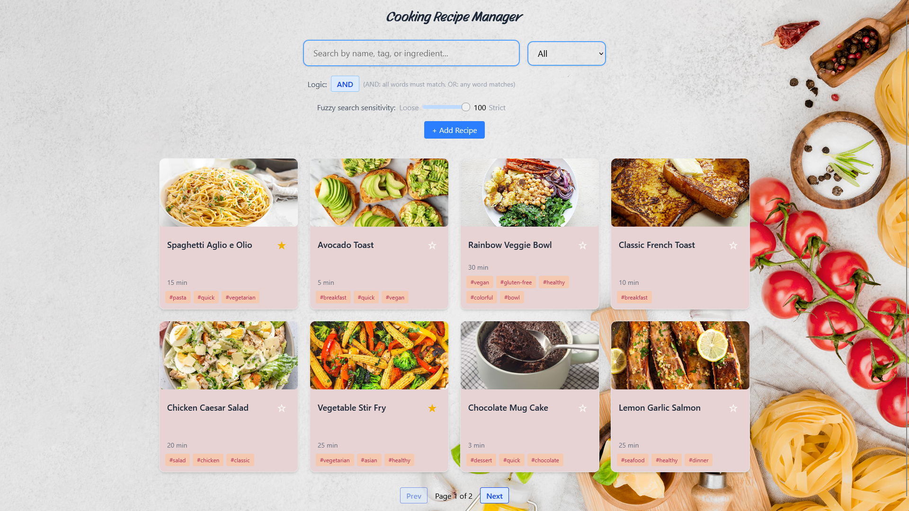

# Cooking Recipe Manager

This is a full-stack cooking recipe manager application with a Vue 3 frontend and FastAPI backend with PostgreSQL database.

[](recipe-manager-ui.png)


## Features

- Clean preview of different recipes in card forms, and to see the details upon selection
- Add new recipes, edit or delete existing ones, and tag favorite recipes
- Fuzzy search and AND/OR logic for filtering based on favorite recipes, and recipe names and tags
- Full-stack application with persistent data storage
- RESTful API with FastAPI backend
- Pinia state management

## Technology Stack

**Frontend:**
- Vue 3 + TypeScript
- Vite
- Tailwind CSS
- Pinia

**Backend:**
- FastAPI
- PostgreSQL
- Docker

## Recipe Data Structure

A recipe object contains the following fields (only `title` is required, all others are optional):

```json
{
   "id": "string",
   "title": "string (required)",
   "image": "string",
   "timeToPrepare": 30, // interger (minutes)
   "ingredients": ["string"],
   "instructions": ["string"],
   "tags": ["string"],
   "caloriesPerServing": 250, // integer
   "servingSize": 4, // integer
   "favorite": false
}
```

## Prerequisites

- Node.js (v16 or higher recommended)
- npm (comes with Node.js)
- Docker Desktop
- Python 3.12

## Getting Started

1. **Clone the repository**
```sh
git clone https://github.com/MinhTran12/cooking-recipe-app.git
cd cooking-recipe-app
```

2. **Start the database with Docker and the backend server**
```sh
cd backend
pip install -r requirements.txt
docker-compose up -d
python db/seed_database.py
python main.py
```

3. **Start the frontend**
```sh
cd ../frontend
npm install
npm run dev
```

## Testing

### Frontend Tests
Navigate to the frontend directory and run:

```sh
cd frontend
npm run test        # Development testing
npm run test:run    # Run tests once
npm run test:ui     # Interactive UI testing
npm run test:coverage  # Coverage report
```

### Backend Tests
Navigate to the backend directory and run:

```sh
cd backend
python -m pytest           # Run all tests
python -m pytest -v        # Verbose output
python -m pytest --cov=.   # Run with coverage report
python -m pytest tests/    # Run specific test directory
```

The tests cover search logic, CRUD operations, API endpoints, and component behavior.

## Documentation

- [Vue 3 Documentation](https://vuejs.org/)
- [Vite Documentation](https://vitejs.dev/)
- [Pinia (State Management)](https://pinia.vuejs.org/)
- [Tailwind Documentation](https://tailwindcss.com/docs)
- [FastAPI Documentation](https://fastapi.tiangolo.com/)
- **API Endpoints**: Available at http://localhost:8000/docs when backend is running

---
